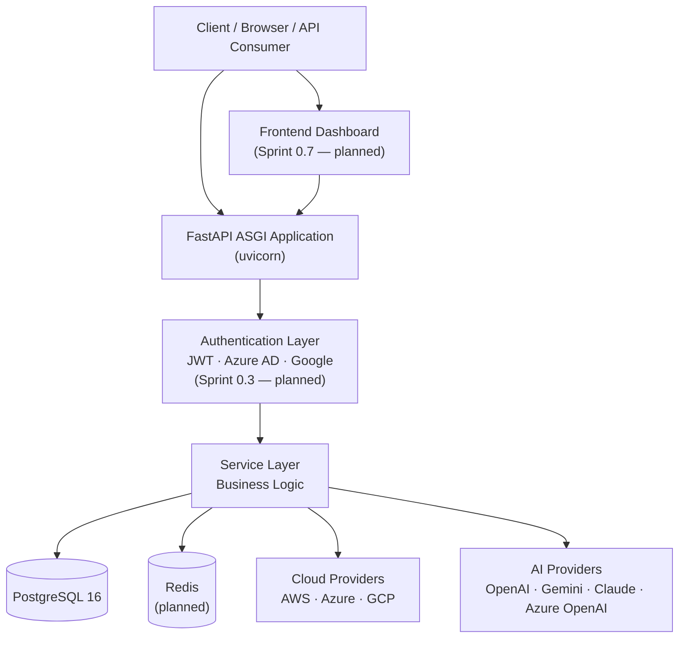
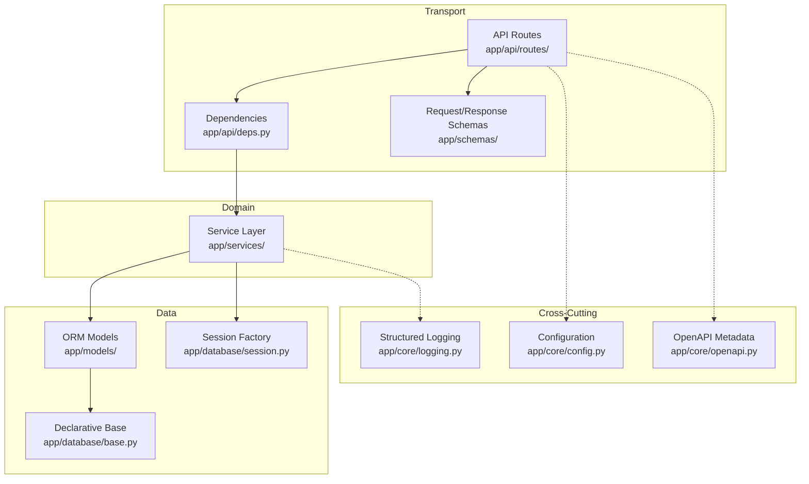
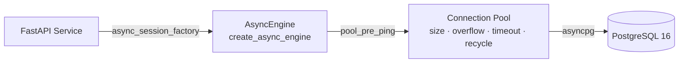
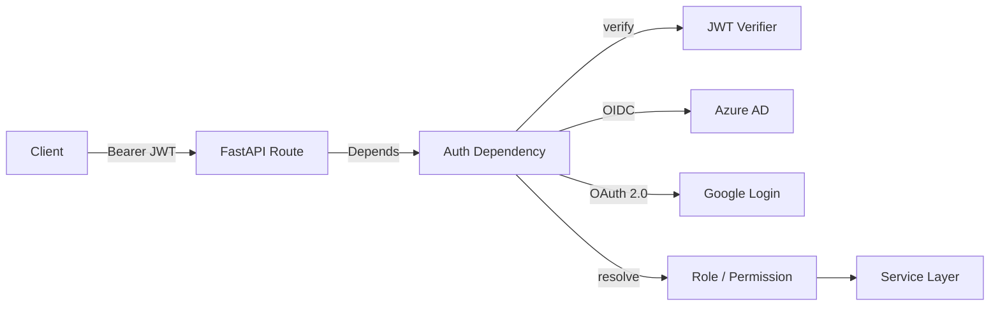
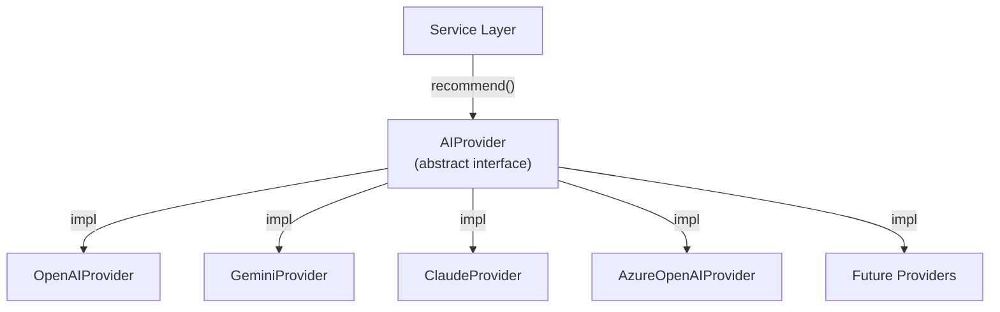
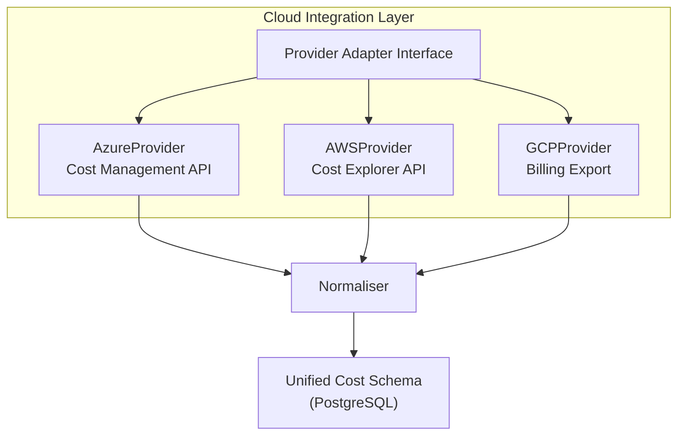
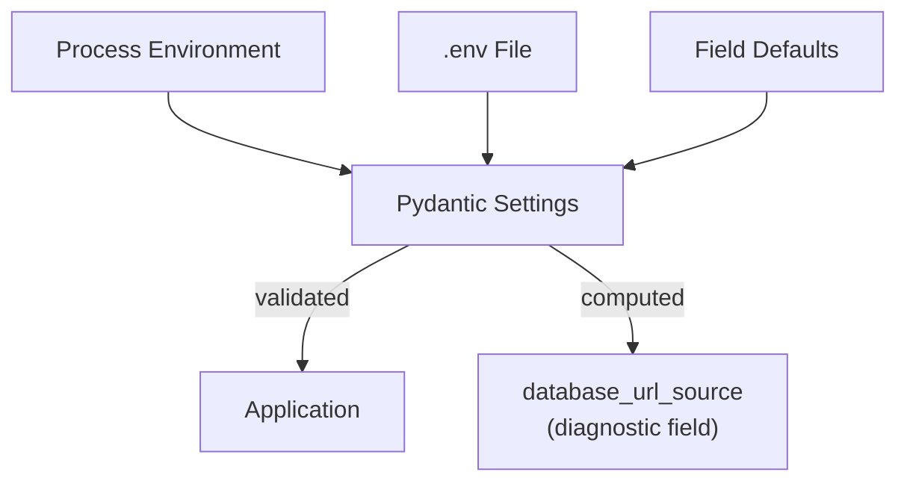
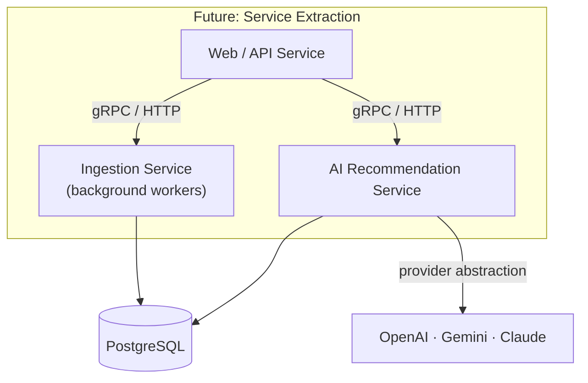
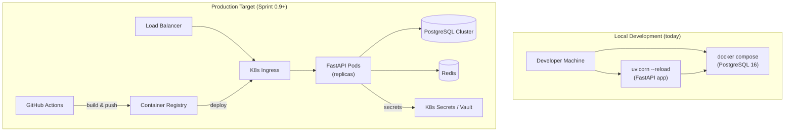

# Architecture

> **Purpose**
> This document is the authoritative architectural reference for the
> Multi-Cloud AI Cost Detective (MCAICD) platform. It describes the system's
> shape, the responsibilities of each layer, the integration seams, and the
> trade-offs that shaped the current design. Every diagram and contract here
> is backed by the ADR trail under [`docs/adr/`](adr/).
>
> **Audience**
> Staff engineers, engineering managers, platform engineers, and
> contributors who need to understand how the system is built, where it is
> headed, and where the seams are for extension.
>
> **Last Updated:** 2026-06-28 (Sprint 0.2)

---

## Table of Contents

- [Overview](#overview)
- [High-Level Architecture](#high-level-architecture)
- [System Components](#system-components)
  - [Backend](#backend)
  - [Database](#database)
  - [Authentication Layer](#authentication-layer)
  - [AI Layer](#ai-layer)
  - [Cloud Integration Layer](#cloud-integration-layer)
  - [Observability](#observability)
  - [Configuration Management](#configuration-management)
  - [Error Handling Strategy](#error-handling-strategy)
  - [Scalability Strategy](#scalability-strategy)
  - [Security Considerations](#security-considerations)
  - [Future Architecture](#future-architecture)
  - [Deployment Architecture](#deployment-architecture)

---

## Overview

MCAICD is a multi-cloud cost intelligence platform. It ingests billing and
usage data from AWS, Azure, and GCP, normalises it into a unified schema,
applies anomaly detection to surface unexpected spend, and exposes
AI-powered recommendations to reduce cloud waste.

The platform is built as a modular FastAPI monolith with a clean separation
between transport (routes), domain logic (services), data (models), and
external integrations (providers). The architecture is deliberately layered
so that the addition of a new cloud provider or a new AI vendor is a
localised change, not a cross-cutting rewrite. The provider-abstraction
contract is recorded in [ADR-0005](adr/ADR-0005-ai-provider-abstraction.md).

**Current state (Sprint 0.2):** the foundation layers are live — application
factory, async database access, migration management, structured logging,
health probe, and configuration. Cloud ingestion, the AI engine, and
authentication are designed-for but not yet implemented; their seams are
described below as forward-looking contracts.

---

## High-Level Architecture

The request path is intentionally simple: a client hits the FastAPI
application, the authentication layer validates identity, the service layer
executes domain logic, and the service layer talks to PostgreSQL (the system
of record), Redis (the cache, planned), cloud provider APIs (for live cost
data ingestion), and AI providers (for recommendation generation).

### Layered View

**Key invariant:** routes never touch the database directly. Every database
operation flows through a service. This is the seam that makes the domain
logic reusable by container orchestrators, startup scripts, and background
workers without going through FastAPI — the same pattern already used by
`HealthService` today.

---

## System Components

### Backend

The backend is an async FastAPI application served by Uvicorn. The
application is constructed by `create_app()` in `app/main.py` using a
factory pattern so the same instance is usable by ASGI servers and test
clients.

| Responsibility | Location | Notes |
| -------------- | -------- | ----- |
| Application factory & lifespan | `app/main.py` | Lifespan hooks configure logging on startup and dispose the DB engine on shutdown. |
| Route aggregation | `app/api/router.py` | All feature routers mounted under `/api/v1`. The root discovery route lives at `/`. |
| Health route | `app/api/routes/health.py` | Readiness probe with a live DB round-trip. Returns 503 on failure. |
| Root route | `app/api/routes/root.py` | Discovery payload: name, version, docs, health links. |
| Dependencies | `app/api/deps.py` | Request-scoped session (`get_db_session`) and session-factory (`get_session_factory`) for graceful degradation. |
| Service layer | `app/services/` | Domain logic, isolated from HTTP. Currently: `HealthService`. |
| OpenAPI metadata | `app/core/openapi.py` | Title, description, tags, contact, licence. |

**Why a factory?** A factory lets tests construct the app with overridden
dependencies, and lets the lifespan hook own the database engine lifecycle
so the engine is disposed on shutdown rather than leaking connections.

**Why async?** Cloud provider APIs and AI providers are network-bound I/O.
An async stack lets a single worker handle many in-flight ingestion and
recommendation calls without thread-pool exhaustion. See
[ADR-0001](adr/ADR-0001-fastapi.md).

### Database

PostgreSQL 16 is the system of record, accessed via async SQLAlchemy 2.x
and `asyncpg`.

| Concern | Implementation |
| ------- | -------------- |
| Driver | `postgresql+asyncpg://` — async, binary protocol, connection pooling. |
| Engine | `create_async_engine` with `pool_pre_ping=True` to detect stale connections before use. |
| Pool tuning | `db_pool_size`, `db_max_overflow`, `db_pool_timeout`, `db_pool_recycle` — all configurable via `Settings`. |
| Session factory | `async_sessionmaker` with `expire_on_commit=False` and `autoflush=False`. |
| Declarative base | `app/database/base.py` — `DeclarativeBase` with a naming convention (`fk_`, `pk_`, `ix_`, `uq_`, `ck_`) so constraints are deterministic and migration-friendly. |
| Migrations | Alembic with an async `env.py`. The initial schema is revision `92b5be269a7b`. |

**Why two session dependencies?** The health endpoint uses
`get_session_factory` (not `get_db_session`) so it can own the session
lifecycle. If it used a request-scoped session and the database were down,
FastAPI would raise during dependency resolution and return a 500 before
the route body could translate the failure into a clean 503. This is a
deliberate, documented trade-off.

**Why `pool_pre_ping`?** Behind load balancers and in serverless-adjacent
deployments, connections can be silently dropped by the network or the
database server. `pool_pre_ping` issues a cheap `SELECT 1` before handing a
connection to the application, surfacing dead connections at checkout time
rather than mid-query.

### Authentication Layer

> **Status:** Planned — Sprint 0.3. Not yet implemented.

The authentication layer will sit between the route layer and the service
layer as a FastAPI dependency.

| Concern | Plan |
| ------- | ---- |
| Primary auth | JWT bearer tokens, verified locally (no per-request call to the IdP). |
| Enterprise SSO | Azure AD via OpenID Connect (OIDC). |
| Consumer SSO | Google Login via OAuth 2.0. |
| Authorisation | Role-based access control (RBAC) — `analyst` (read-only) and `admin` (write + config). |
| Token issuance | `/api/v1/auth/token` after an OIDC/OAuth exchange; refresh tokens for long-lived sessions. |
| Public endpoints | `GET /` and `GET /api/v1/health` remain unauthenticated — health probes must work before auth is bootstrapped. |

The decision to make health unauthenticated is deliberate: orchestrators
and load balancers probe health without credentials, and a 501 on a health
check is operationally indistinguishable from a down instance.

### AI Layer

> **Status:** Planned — Sprint 0.5. Designed-for via the provider
> abstraction (ADR-0005). Not yet implemented.

The AI layer generates cost recommendations. It is built behind an
abstraction so the choice of model — OpenAI, Gemini, Claude, or Azure
OpenAI — is a configuration switch, not a code change.

| Concern | Plan |
| ------- | ---- |
| Interface | A common `AIProvider` protocol with `recommend(cost_data) -> Recommendation`. |
| Selection | `Settings.ai_provider` selects the active implementation at startup. |
| Fallback | A secondary provider can be configured for graceful degradation when the primary is unavailable. |
| Cost data shape | The normalised cost schema (from the cloud integration layer) is the prompt input — no provider-specific serialisation in the service layer. |
| Output | Ranked recommendations with estimated savings, confidence, and a human-readable rationale. |

The abstraction is the single most important seam for avoiding vendor
lock-in. It is recorded in [ADR-0005](adr/ADR-0005-ai-provider-abstraction.md).

### Cloud Integration Layer

> **Status:** Planned — Sprint 0.4. Not yet implemented.

The cloud integration layer ingests billing and usage data from each
provider and normalises it into the unified schema.

| Concern | Plan |
| ------- | ---- |
| Interface | A common `CloudProvider` protocol with `ingest(since, until) -> CostRecord[]`. |
| Providers | Azure (Cost Management REST API), AWS (Cost Explorer API), GCP (BigQuery billing export). |
| Normalisation | Each provider's native schema is mapped to the unified `CostRecord` (resource, provider, region, service, cost, tags, timestamp). |
| Scheduling | Ingestion runs on a schedule (planned: APScheduler / Celery beat). |
| Idempotency | Ingestion is keyed by (provider, resource, period) so re-runs do not duplicate rows. |
| Credential management | Provider credentials stored as secrets, never in the repository or `.env` in production. |

### Observability

> **Status:** Structured logging is live. Metrics, tracing, and dashboards
> are planned.

| Pillar | Status | Plan |
| ------ | ------ | ---- |
| **Logging** | ✅ Live | Structured JSON via `JsonFormatter` in `app/core/logging.py`. Every log line is a JSON object with `timestamp`, `level`, `logger`, `message`, and arbitrary structured fields. The `uvicorn.access` logger is captured. |
| **Health** | ✅ Live | `GET /api/v1/health` — a readiness probe with a live `SELECT 1`. Returns 503 when the database is unreachable. |
| **Metrics** | ⏳ Planned | Prometheus `/metrics` endpoint with RED metrics (rate, errors, duration) per route, plus DB pool gauges. |
| **Tracing** | ⏳ Planned | OpenTelemetry traces propagating through the service and provider-call boundaries. |
| **Dashboards** | ⏳ Planned | Grafana dashboards derived from Prometheus metrics and structured logs. |

The structured-logging contract is the foundation: metrics and traces will
correlate to log lines via a shared `request_id` / `trace_id` field so an
operator can pivot from a dashboard spike to the exact log entries in one
step.

### Configuration Management

All configuration flows through `app/core/config.py` (Pydantic Settings v2).
No application code reads environment variables directly.

| Property | Mechanism |
| -------- | --------- |
| Precedence | CLI args > process env > `.env` file > field defaults. |
| Validation | Pydantic v2 validates types, ranges, and `Literal` enums at construction. |
| Diagnostics | `database_url_source` reports whether `DATABASE_URL` came from the process env, the `.env` file, or the default — surfaced in `alembic env.py` and `scripts/check_db.py` to eliminate the most common setup footgun. |
| Environments | `app_env` is a `Literal["local", "development", "staging", "production"]`. `is_production` is a computed field. |
| Secrets | Never committed. `.gitignore` excludes `.env` and `.env.*` (except `.env.example`). Production secrets will be injected via the orchestrator's secret store (planned). |

### Error Handling Strategy

The error-handling philosophy is: **fail with enough context to act, never
silently.**

| Scenario | Behaviour |
| -------- | --------- |
| Database unreachable (health probe) | `HealthService` catches `SQLAlchemyError` and `OSError`, logs the exception, and returns `status=unhealthy`. The route sets HTTP 503 so load balancers drain the instance. |
| Database unreachable (CRUD endpoint) | The request-scoped session raises during dependency resolution. FastAPI returns 500. A global exception handler (planned) will translate this into a structured error response. |
| Invalid request body | Pydantic validation returns 422 with a detailed error list. FastAPI default behaviour, retained. |
| Unknown route | FastAPI returns 404. |
| Provider API failure (planned) | The provider adapter retries with exponential backoff, then surfaces a typed `ProviderError` that the service layer translates into a 502/504. |

**Why catch `OSError` in the health probe?** `asyncpg` raises
`ConnectionRefusedError` (an `OSError` subclass) when the database is
unreachable, and SQLAlchemy does not always wrap it in `SQLAlchemyError`.
Without the explicit catch, a DB-down health check would surface as an
unhandled 500 instead of a clean 503.

### Scalability Strategy

MCAICD is designed to scale horizontally, not vertically.

| Axis | Strategy |
| ---- | -------- |
| **Web tier** | Stateless FastAPI workers behind a load balancer. Statelessness is preserved by keeping all state in PostgreSQL (and, later, Redis). |
| **Database** | Connection pooling with tunable `pool_size` / `max_overflow`. Read replicas for reporting queries (planned). |
| **Ingestion** | Background workers (planned: Celery / APScheduler) so ingestion does not block web requests. Each provider is an independent job. |
| **AI calls** | Bounded concurrency on AI provider calls to avoid rate limits; results cached in Redis (planned). |
| **Caching** | Redis for provider API response caching and AI recommendation caching (planned). |

The single-process, async-first design is the scaling unit. Adding capacity
means adding workers, not rewriting the application. The provider and AI
abstractions ensure that the fan-out across external services is a
configuration concern, not a code concern.

### Security Considerations

| Concern | Approach |
| ------- | -------- |
| **Secrets** | All configuration via `Settings`. `.env` is git-ignored. Production secrets via orchestrator secret stores (planned). |
| **SQL injection** | SQLAlchemy ORM and parameterised queries only. No string-concatenated SQL. |
| **Input validation** | Pydantic v2 models on every request/response. `Literal` types for fixed-value fields. `extra="forbid"` on response models to prevent schema drift. |
| **Auth (planned)** | JWT verification on every non-health route. RBAC for write operations. |
| **CORS** | `CORS_ORIGINS` is an explicit allow-list, default empty. |
| **Dependency hygiene** | Lower-bound pins with `>=` ranges. No dependency added without maintainer review. A Dependabot configuration is planned. |
| **Logging safety** | The alembic `env.py` and `scripts/check_db.py` mask database URLs before logging so credentials never reach log sinks. |

See [`SECURITY.md`](../SECURITY.md) for the full vulnerability reporting and
contributor security policy.

### Future Architecture

The monolith-first approach is intentional. The architecture is layered so
that extracting a service later is a mechanical boundary-drawing exercise,
not a re-architecture. The most likely extraction candidates:

| Candidate | Trigger to extract | Boundary |
| --------- | ------------------ | -------- |
| Ingestion service | When ingestion load dominates worker CPU and blocks web requests. | Shared PostgreSQL, no shared process. |
| AI recommendation service | When model calls have different scaling and cost profiles than web traffic. | The `AIProvider` interface becomes a network contract. |
| Frontend | Sprint 0.7 ships a frontend; it may become a separate deployment for CDN/caching reasons. | Same API, different deployable. |

The provider abstraction (ADR-0005) and the clean layering (ADR-0003) exist
specifically to keep this option open. We will not extract services
prematurely; the monolith is the simpler operable system until a measured
bottleneck justifies the cost.

### Deployment Architecture

> **Status:** Docker Compose for local PostgreSQL is live. Application
> containerisation and Kubernetes deployment are planned for Sprint 0.9.

| Stage | Mechanism |
| ----- | -------- |
| Local | `docker compose up -d` for PostgreSQL; `uvicorn --reload` for the app. |
| Container (planned) | A `Dockerfile` for the application itself, multi-stage, slim base. |
| Orchestration (planned) | Kubernetes manifests + Helm chart. HPA on CPU and request rate. |
| IaC (planned) | Terraform for cloud backing (VPC, RDS, ElastiCache, IAM). |
| CI/CD (planned) | GitHub Actions: lint → test → build → push → deploy. |
| Secrets (planned) | K8s Secrets or an external secrets operator; never baked into the image. |

The deployment target is deliberately provider-agnostic at the platform
level: the same Helm chart deploys to EKS, AKS, or GKE. The cloud being
monitored does not have to be the cloud hosting the platform.
