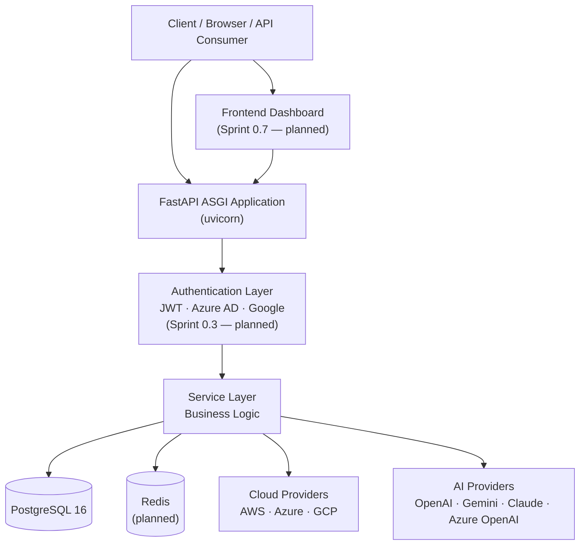
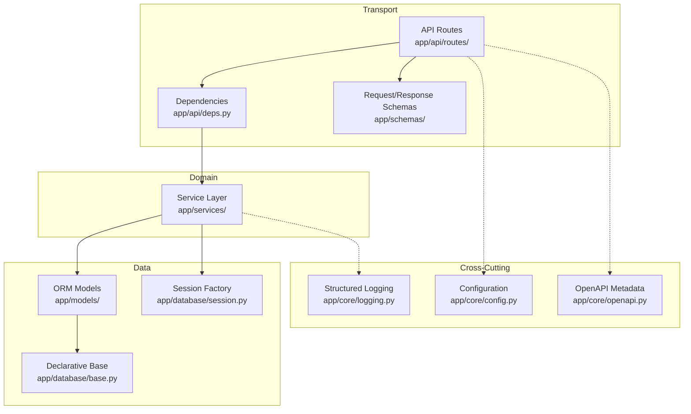
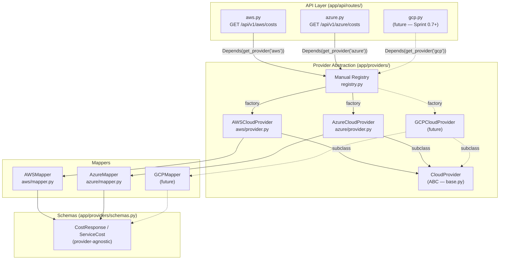
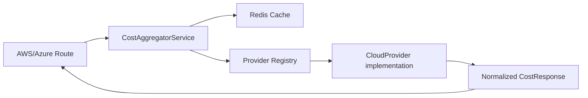
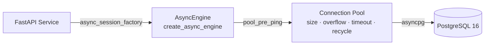
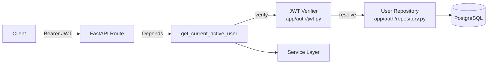
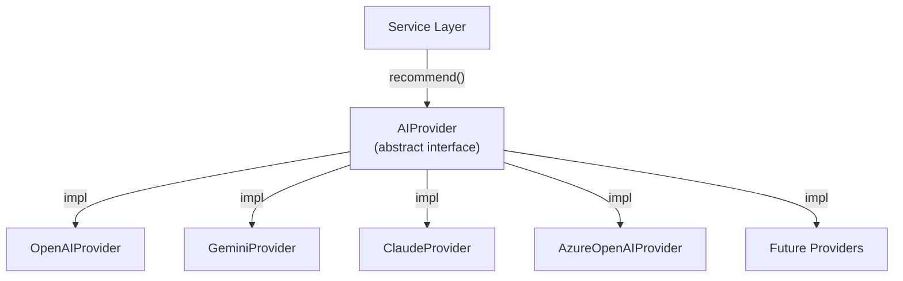
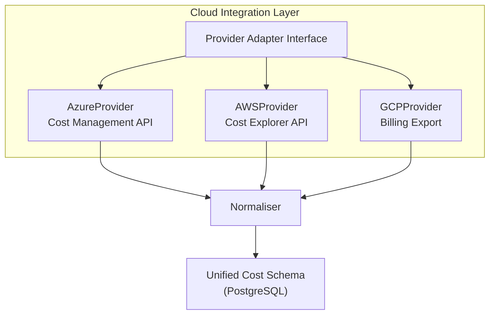
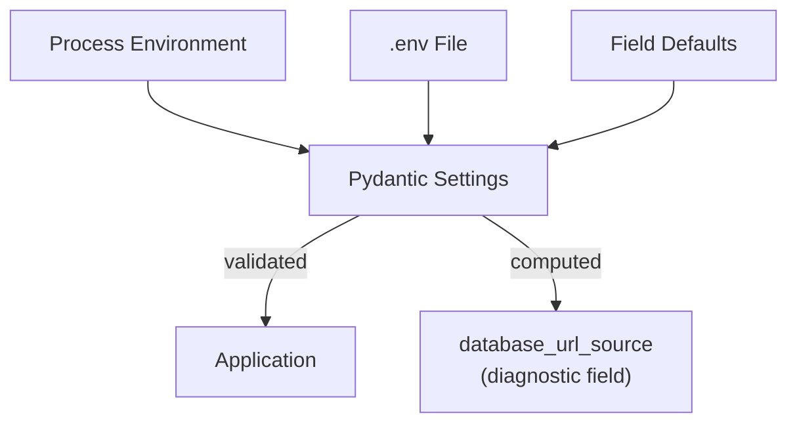
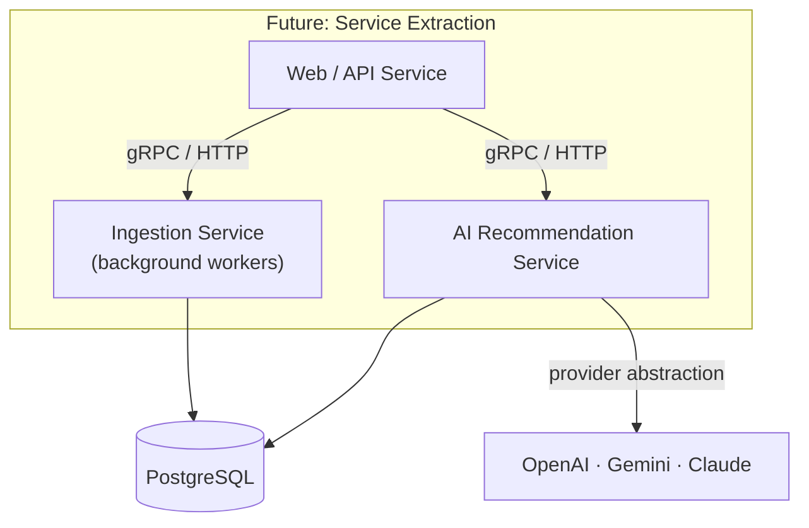

# Architecture

> **Purpose**
> This document is the authoritative architectural reference for the
> Multi-Cloud AI Cost Detective (MCAICD) platform. It describes the system's
> shape, the responsibilities of each layer, the integration seams, and the
> trade-offs that shaped the current design. Every diagram and contract here
> is backed by the ADR trail under [`docs/adr/`](adr/).
>
> **Audience**
> Staff engineers, engineering managers, platform engineers, and
> contributors who need to understand how the system is built, where it is
> headed, and where the seams are for extension.
>
> **Last Updated:** 2026-07-12 (Sprint 1.0)

---

## Table of Contents

- [Overview](#overview)
- [High-Level Architecture](#high-level-architecture)
- [Cloud Provider Abstraction](#cloud-provider-abstraction)
- [System Components](#system-components)
  - [Backend](#backend)
  - [Database](#database)
  - [Cost Query Pipeline](#cost-query-pipeline)
  - [Authentication Layer](#authentication-layer)
  - [AI Layer](#ai-layer)
  - [Cloud Integration Layer](#cloud-integration-layer)
  - [Observability](#observability)
  - [Configuration Management](#configuration-management)
  - [Error Handling Strategy](#error-handling-strategy)
  - [Scalability Strategy](#scalability-strategy)
  - [Security Considerations](#security-considerations)
  - [Future Architecture](#future-architecture)
  - [Deployment Architecture](#deployment-architecture)

---

## Overview

MCAICD is a multi-cloud cost intelligence platform. It ingests billing and
usage data from AWS, Azure, and GCP, normalises it into a unified schema,
applies anomaly detection to surface unexpected spend, and exposes
AI-powered recommendations to reduce cloud waste.

The platform is built as a modular FastAPI monolith with a clean separation
between transport (routes), domain logic (services), data (models), and
external integrations (providers). The architecture is deliberately layered
so that the addition of a new cloud provider or a new AI vendor is a
localised change, not a cross-cutting rewrite. The provider-abstraction
contract is recorded in [ADR-0005](adr/ADR-0005-ai-provider-abstraction.md).

**Current state (Sprint 1.0):** the foundation layers are live — application
factory, async database access, migration management, structured logging,
health probe, configuration, cloud provider integrations, unified cost
aggregation, Redis caching, rate limiting, and JWT Bearer authentication.
The AI engine remains planned for Sprint 0.5; its seams are described below
as forward-looking contracts.

---

## High-Level Architecture



The request path is intentionally simple: a client hits the FastAPI
application, the authentication layer validates identity, the service layer
executes domain logic, and the service layer talks to PostgreSQL (the system
of record), Redis (the cache, planned), cloud provider APIs (for live cost
data ingestion), and AI providers (for recommendation generation).

### Layered View



**Key invariant:** routes never touch the database directly. Every database
operation flows through a service. This is the seam that makes the domain
logic reusable by container orchestrators, startup scripts, and background
workers without going through FastAPI — the same pattern already used by
`HealthService` today.

---

## Cloud Provider Abstraction

> **Status:** Live — Sprint 0.6. AWS (Sprint 0.5) and Azure (Sprint 0.6) are
> concrete implementations behind the shared abstraction. GCP remains
> planned for a later sprint; only AWS and Azure are delivered today.

The cloud-provider abstraction gives the rest of the application a single,
uniform seam for talking to any cloud vendor. The platform no longer
imports vendor service layers directly from route handlers; instead every
cloud integration goes through `app/providers/`, and adding a new vendor is
a localised change rather than a cross-cutting rewrite. AWS is the
reference implementation; Azure follows the same contract end-to-end and
exercises every part of the abstraction, including subscription discovery
and a vendor-specific credential chain.



### `CloudProvider` interface

The single contract every cloud vendor must satisfy is the
`CloudProvider` ABC in `app/providers/base.py`. It declares four abstract
methods:

| Method | Responsibility |
| ------ | -------------- |
| `provider_name() -> str` | Return the short identifier for this provider (e.g. `"aws"`, `"azure"`, `"gcp"`). Used for logging and as the `provider` field on `CostResponse`. |
| `authenticate() -> None` | Initialise the underlying vendor client using the configured credentials. Credential errors are allowed to propagate so callers can surface them via `validate_credentials` or `get_costs`. |
| `validate_credentials() -> bool` | Return `True` only when the configured credentials are usable. Implementations typically call `authenticate()` and translate credential errors into a `False` return. |
| `async def get_costs(start_date, end_date, granularity) -> CostResponse` | Retrieve normalized costs for the date range and granularity. Implementations translate vendor-specific exceptions into the provider-agnostic hierarchy (see below) so route handlers can react without depending on the underlying SDK. |

The interface deliberately returns the normalized `CostResponse` rather
than a vendor-specific dict. That is what makes the rest of the
application provider-agnostic.

### Normalized response model

The shapes that flow out of `get_costs` are defined in
`app/providers/schemas.py` and are shared by every vendor:

* `CostResponse` — the top-level payload returned by the route. Fields:
  `provider` (the short identifier), `currency` (defaults to `"USD"`),
  `total_cost`, `date_range` (a `dict[str, str]` carrying `start`,
  `end`, and `granularity`), and `services` (a list of `ServiceCost`).
* `ServiceCost` — a single per-service row: `service_name` (str) and
  `cost` (float, `>= 0`).

Both models use `model_config = ConfigDict(extra="forbid")` so callers
cannot accidentally smuggle vendor-specific fields through the contract.
`ServiceCost` additionally sets `from_attributes=True` so it can be built
from ORM-style objects in the future. The `ge=0` constraint on cost fields
makes "negative spend" a 422 rather than a silent zero at the boundary.

### Mapper responsibility

Concrete providers are paired with a stateless mapper whose only job is to
translate the vendor's response shape into `CostResponse`. For AWS that is
`app/providers/aws/mapper.py` (`AWSMapper`). The mapper:

* Receives the raw dict already produced by the underlying vendor service
  (`CostExplorerService.get_costs`) along with the original request
  parameters (`start_date`, `end_date`, `granularity`).
* Defensively fills in `date_range` and `services` if the upstream
  response omits them, so callers never have to special-case partial
  payloads.
* Returns a fully validated `CostResponse`.

Keeping mapping in its own class means the translation logic can be
unit-tested without instantiating any cloud SDK or HTTP client.

### Manual registry and `Depends` injection

Provider lookup goes through `app/providers/registry.py`, which is a
deliberately minimal, dependency-free registry:

```python
PROVIDER_REGISTRY: dict[str, Callable[[], CloudProvider]] = {}
```

* `register_provider(name, factory)` — stores a zero-argument factory
  under `name`. Re-registering an existing name overwrites the entry,
  which keeps tests and tooling able to swap implementations without
  restarting the process.
* `get_provider_factory(name)` — returns the registered factory or
  raises `ProviderError(error_code="PROVIDER_NOT_REGISTERED")` when the
  name is unknown.
* `get_provider(name)` — returns a `Depends`-compatible callable that
  builds and returns a fresh `CloudProvider` instance per request. Routes
  consume it like any other FastAPI dependency:

  ```python
  provider: Annotated[CloudProvider, Depends(get_provider("aws"))]
  ```

The AWS and Azure packages (`app/providers/aws/__init__.py` and
`app/providers/azure/__init__.py`) each register themselves at import
time with a single line:

```python
register_provider("aws", lambda: AWSCloudProvider())
register_provider("azure", lambda: AzureCloudProvider())
```

Because `app/providers/__init__.py` imports both sub-packages, those
registrations run as a side-effect of importing the abstraction package,
so every route that uses `Depends(get_provider("aws"))` or
`Depends(get_provider("azure"))` resolves to a live instance with no
extra wiring.

### Implemented providers

The shared abstraction is satisfied by two concrete providers today:

| Provider | Class | Mapper | Service module | Route | Registry key |
| -------- | ----- | ------ | -------------- | ----- | ------------ |
| AWS | `AWSCloudProvider` (`app/providers/aws/provider.py`) | `AWSMapper` (`app/providers/aws/mapper.py`) | `app/services/aws/cost_explorer.py` | `GET /api/v1/aws/costs` | `"aws"` |
| Azure | `AzureCloudProvider` (`app/providers/azure/provider.py`) | `AzureMapper` (`app/providers/azure/mapper.py`) | `app/services/azure/cost_management.py` | `GET /api/v1/azure/costs` | `"azure"` |
| GCP | `GCPCloudProvider` *(planned)* | `GCPMapper` *(planned)* | *(planned)* | *(planned)* | `"gcp"` |

The AWS row is the reference implementation delivered in Sprint 0.5.
The Azure row was added in Sprint 0.6 and is described in detail below.
The GCP row is the next vendor to land; until then the registry has no
`"gcp"` entry and `Depends(get_provider("gcp"))` will raise
`ProviderError(error_code="PROVIDER_NOT_REGISTERED")`.

### Azure Provider

Azure is the second concrete implementation of the `CloudProvider`
abstraction, delivered in Sprint 0.6. The implementation lives under
`app/providers/azure/` and the route is mounted at
`GET /api/v1/azure/costs`. It exercises every part of the abstraction —
the registry, the mapper, the provider-agnostic exception hierarchy,
and a vendor-specific credential chain — using the Azure Cost
Management Query API as the data source.

#### Authentication

`AzureCloudProvider.authenticate()` delegates to
`AzureCostManagementService._ensure_credential()`, which builds an
Azure SDK credential from the configured settings:

* **Service-principal path** — when `AZURE_TENANT_ID`,
  `AZURE_CLIENT_ID`, and `AZURE_CLIENT_SECRET` are all set, the service
  constructs an explicit `ClientSecretCredential`. This is the
  recommended path for non-interactive automation (CI, scheduled
  ingestion, containers without a managed identity).
* **Default credential chain** — otherwise the service constructs
  `DefaultAzureCredential`, which tries the following sources in order
  and uses the first that succeeds:
  * **Managed Identity** — for workloads running inside Azure (App
    Service, Functions, AKS, VMs with the managed-identity extension).
  * **Azure CLI** — the developer's `az login` session, used in local
    development. No environment variables are required.
  * **Environment variables** — service-principal credentials supplied
    via `AZURE_TENANT_ID`, `AZURE_CLIENT_ID`, and
    `AZURE_CLIENT_SECRET`, surfaced by `EnvironmentCredential` inside
    the chain.

Credential failures surface as `AzureCredentialsError`, which the
provider translates into the provider-agnostic
`ProviderCredentialsError` (HTTP 500). The disabled flag
`AZURE_COST_MANAGEMENT_ENABLED` short-circuits all of the above: when
set to `False` the service returns an empty `CostResponse` without
constructing any SDK client.

#### Subscription ID resolution

`AzureCostManagementService._resolve_subscription_id()` resolves the
target subscription as follows:

1. **Configured subscription** — if `AZURE_SUBSCRIPTION_ID` is set,
   that value is used verbatim. No call to the Subscription API is
   made, so a request that has a configured subscription never touches
   `SubscriptionClient`.
2. **Default subscription discovery** — otherwise the service queries
   `SubscriptionClient.subscriptions.list()` and returns the first
   subscription whose `state == "Enabled"`.

Errors during discovery are translated into the provider-agnostic
hierarchy: authentication failures become `ProviderCredentialsError`,
permission failures become `ProviderPermissionsError`, and a missing or
disabled subscription becomes `ProviderInvalidDateRangeError` (HTTP 400
at the route layer).

#### Cost Management Query API

The provider queries the Azure Cost Management Query API with a `Usage`
query grouped by `ServiceName`. The query shape is:

* **Type:** `Usage`
* **Timeframe:** `Custom` (using the caller-supplied `start_date` and
  `end_date`)
* **Granularity:** `Daily` or `Monthly` (capitalised for the API)
* **Aggregation:** `totalCost` summed as `Cost`
* **Grouping:** `Dimension` on `ServiceName`

The query is executed against the scope
`/subscriptions/{subscription_id}` and the response rows are normalised
into `CostResponse` by `AzureMapper` (which mirrors the defensive
defaults applied by `AWSMapper`: missing `date_range` or `services` are
filled in from the request parameters so callers never have to
special-case partial payloads).

#### Registry registration

`app/providers/azure/__init__.py` registers the Azure factory at import
time:

```python
from app.providers.azure.mapper import AzureMapper
from app.providers.azure.provider import AzureCloudProvider
from app.providers.registry import register_provider

register_provider("azure", lambda: AzureCloudProvider())
```

Because `app/providers/__init__.py` imports both the `aws` and `azure`
sub-packages, both registrations run as a side-effect of importing the
abstraction package. There is no extra wiring in the route layer —
`Depends(get_provider("azure"))` resolves to a live `AzureCloudProvider`
instance per request, exactly like the AWS equivalent.

| Concern | Implementation |
| ------- | -------------- |
| Provider class | `app/providers/azure/provider.py` — `AzureCloudProvider` |
| Mapper class | `app/providers/azure/mapper.py` — `AzureMapper` |
| Underlying service | `app/services/azure/cost_management.py` — `AzureCostManagementService` |
| Azure SDK packages | `azure-identity`, `azure-mgmt-costmanagement`, `azure-mgmt-subscription` |
| Route | `GET /api/v1/azure/costs` (mounted in `app/api/router.py`) |
| Registry key | `"azure"` |

### Provider-agnostic exceptions

`app/providers/exceptions.py` defines the `ProviderError` hierarchy that
every concrete provider is expected to raise:

| Exception | Default `error_code` | Intended HTTP mapping |
| --------- | -------------------- | --------------------- |
| `ProviderError` (base) | `PROVIDER_ERROR` | 500 (fallback) |
| `ProviderCredentialsError` | `PROVIDER_CREDENTIALS_ERROR` | 500 |
| `ProviderPermissionsError` | `PROVIDER_PERMISSIONS_ERROR` | 403 |
| `ProviderInvalidDateRangeError` | `PROVIDER_INVALID_DATE_RANGE` | 400 |
| `ProviderThrottlingError` | `PROVIDER_THROTTLING_ERROR` | 429 |
| `ProviderServiceError` | `PROVIDER_SERVICE_ERROR` | 502 |

Every concrete provider must translate its vendor-specific errors into
these types. The AWS implementation (`AWSCloudProvider.get_costs`) does
this explicitly: it catches `AWSCredentialsError`, `AWSThrottlingError`,
`AWSPermissionsError`, `AWSInvalidDateRangeError`, `AWSServiceError`,
`NoCredentialsError`, and `ClientError`, and re-raises each as the
matching provider-agnostic exception.

The AWS route (`app/api/routes/aws.py`) is in a transition window: it
imports **both** the old AWS-specific exceptions from
`app/services/aws/exceptions.py` and the new provider-agnostic ones from
`app/providers/exceptions.py`, and catches each pair with the same HTTP
mapping. This dual mapping guarantees that callers see the same status
codes and `X-Error-Code` headers regardless of which exception layer the
underlying service raises:

```python
except (AWSInvalidDateRangeError, ProviderInvalidDateRangeError) as e:
    raise HTTPException(status_code=400, detail=e.message,
                        headers={"X-Error-Code": e.error_code}) from e
except (AWSCredentialsError, ProviderCredentialsError) as e:
    raise HTTPException(status_code=500, ...) from e
except (AWSThrottlingError, ProviderThrottlingError) as e:
    raise HTTPException(status_code=429, ...) from e
except (AWSPermissionsError, ProviderPermissionsError) as e:
    raise HTTPException(status_code=403, ...) from e
except (AWSServiceError, ProviderServiceError) as e:
    raise HTTPException(status_code=502, ...) from e
```

Once the AWS service layer is fully retired, the AWS-specific `except`
clauses can be removed and the route can drop the dual import.

### Extension guide: adding GCP

Adding a new cloud vendor is a four-step, additive change. Each step is
localised to a new directory under `app/providers/` plus a single new
route file.

1. **Implement the provider.** Create `app/providers/<name>/provider.py`
   with a concrete subclass of `CloudProvider`:

   ```python
   class AzureCloudProvider(CloudProvider):
       def provider_name(self) -> str: return "azure"
       def authenticate(self) -> None: ...
       def validate_credentials(self) -> bool: ...
       async def get_costs(self, start_date, end_date, granularity) -> CostResponse: ...
   ```

   Translate every vendor exception into the
   `app.providers.exceptions.ProviderError` hierarchy so the route layer
   stays SDK-agnostic.

2. **Implement the mapper.** Create `app/providers/<name>/mapper.py`
   with a stateless class that converts the vendor response into
   `CostResponse` (mirroring `AWSMapper`). Keep mapping separate from
   I/O so it can be unit-tested in isolation.

3. **Register the factory.** In `app/providers/<name>/__init__.py`,
   import the implementation and the mapper and register a zero-argument
   factory:

   ```python
   from app.providers.registry import register_provider
   from app.providers.gcp.provider import GCPCloudProvider

   register_provider("gcp", lambda: GCPCloudProvider())
   ```

   Because `app/providers/__init__.py` re-exports the public API, the
   GCP sub-package should be imported there (or its `__init__` should
   be picked up transitively) so registration runs at process start.

4. **Add a route.** Create `app/api/routes/<name>.py` with a FastAPI
   router that resolves the implementation through the registry:

   ```python
   provider: Annotated[CloudProvider, Depends(get_provider("gcp"))]
   ```

   Return `CostResponse` and catch each `ProviderError` subclass,
   mapping it to the HTTP status codes documented in the table above.
   Mount the router under `/api/v1` from `app/api/router.py`.

### Scope note

This section is the cumulative record of what the cloud-provider
abstraction has delivered across sprints:

* **Sprint 0.5** delivered the shared abstraction and the AWS refactor:
  the `CloudProvider` ABC, the `CostResponse` / `ServiceCost` schemas,
  the manual registry, the `ProviderError` hierarchy,
  `AWSCloudProvider`, `AWSMapper`, and the AWS route updated to consume
  the registry via `Depends`.
* **Sprint 0.6** added the Azure implementation on top of that
  foundation: `AzureCloudProvider`, `AzureMapper`,
  `AzureCostManagementService` (with `DefaultAzureCredential` and
  service-principal support), the Azure-specific exception hierarchy in
  `app/services/azure/exceptions.py`, the Azure request schema, the
  `GET /api/v1/azure/costs` route, and the `"azure"` entry in the
  registry.
* **GCP** (`GCPCloudProvider`) remains the next vendor to land and will
  follow the extension guide above in a later sprint.

---

## System Components

### Backend

The backend is an async FastAPI application served by Uvicorn. The
application is constructed by `create_app()` in `app/main.py` using a
factory pattern so the same instance is usable by ASGI servers and test
clients.

| Responsibility | Location | Notes |
| -------------- | -------- | ----- |
| Application factory & lifespan | `app/main.py` | Lifespan hooks configure logging on startup, initialise/shutdown Redis, and dispose the DB engine on shutdown. |
| Route aggregation | `app/api/router.py` | All feature routers mounted under `/api/v1`. The root discovery route lives at `/`. |
| Health route | `app/api/routes/health.py` | Readiness probe with live DB and Redis checks. Returns 503 when either dependency is down. |
| Root route | `app/api/routes/root.py` | Discovery payload: name, version, docs, health links. |
| Dependencies | `app/api/deps.py` | Request-scoped session (`get_db_session`) and session-factory (`get_session_factory`) for graceful degradation. |
| Service layer | `app/services/` | Domain logic, isolated from HTTP. Currently: `HealthService` and `CostAggregatorService`. |
| OpenAPI metadata | `app/core/openapi.py` | Title, description, tags, contact, licence. |

### Cost Query Pipeline

Cost retrieval now flows through a provider-independent aggregation service
instead of route handlers talking to providers directly.



| Concern | Implementation |
| ------- | -------------- |
| Aggregation | `app/services/cost_aggregator.py` validates the provider, resolves the registered implementation, and returns the normalized `CostResponse`. |
| Cache key | `provider + subscription/account scope + start/end date + granularity`. |
| Cache policy | JSON payloads are cached for `CACHE_TTL_SECONDS` (default: 300). Cache failures fall back to the provider call. |
| Rate limiting | AWS and Azure cost routes are rate limited per client IP using `RATE_LIMIT_PER_MINUTE` (default: 60/minute). |
| Route design | Routes remain thin: validation, auth, aggregation call, typed HTTP error translation. |

**Why a factory?** A factory lets tests construct the app with overridden
dependencies, and lets the lifespan hook own the database engine lifecycle
so the engine is disposed on shutdown rather than leaking connections.

**Why async?** Cloud provider APIs and AI providers are network-bound I/O.
An async stack lets a single worker handle many in-flight ingestion and
recommendation calls without thread-pool exhaustion. See
[ADR-0001](adr/ADR-0001-fastapi.md).

### Database

PostgreSQL 16 is the system of record, accessed via async SQLAlchemy 2.x
and `asyncpg`.



| Concern | Implementation |
| ------- | -------------- |
| Driver | `postgresql+asyncpg://` — async, binary protocol, connection pooling. |
| Engine | `create_async_engine` with `pool_pre_ping=True` to detect stale connections before use. |
| Pool tuning | `db_pool_size`, `db_max_overflow`, `db_pool_timeout`, `db_pool_recycle` — all configurable via `Settings`. |
| Session factory | `async_sessionmaker` with `expire_on_commit=False` and `autoflush=False`. |
| Declarative base | `app/database/base.py` — `DeclarativeBase` with a naming convention (`fk_`, `pk_`, `ix_`, `uq_`, `ck_`) so constraints are deterministic and migration-friendly. |
| Migrations | Alembic with an async `env.py`. The initial schema is revision `92b5be269a7b`. |

**Why two session dependencies?** The health endpoint uses
`get_session_factory` (not `get_db_session`) so it can own the session
lifecycle. If it used a request-scoped session and the database were down,
FastAPI would raise during dependency resolution and return a 500 before
the route body could translate the failure into a clean 503. This is a
deliberate, documented trade-off.

**Why `pool_pre_ping`?** Behind load balancers and in serverless-adjacent
deployments, connections can be silently dropped by the network or the
database server. `pool_pre_ping` issues a cheap `SELECT 1` before handing a
connection to the application, surfacing dead connections at checkout time
rather than mid-query.

### Authentication Layer

> **Status:** Live — Sprint 0.3 / Sprint 1.0. JWT Bearer authentication is
> implemented and protects all cost endpoints.

The authentication layer sits between the route layer and the service
layer as a FastAPI dependency. Two reusable dependencies are exposed:

- `get_current_user` — validates the JWT and returns the authenticated
  `User` model.
- `get_current_active_user` — wraps `get_current_user` and additionally
  rejects inactive users.

Both dependencies are provider-agnostic and can be attached to any current
or future endpoint with `Depends(get_current_active_user)`.



| Concern | Implementation |
| ------- | -------------- |
| Primary auth | JWT bearer tokens (`HS256`), verified locally. Access tokens expire after `ACCESS_TOKEN_EXPIRE_MINUTES`; refresh tokens expire after `REFRESH_TOKEN_EXPIRE_DAYS`. |
| Password storage | Passwords are hashed with bcrypt and stored as `password_hash` on the `User` model. |
| Token lifecycle | `/api/v1/auth/register`, `/api/v1/auth/login`, `/api/v1/auth/refresh`, `/api/v1/auth/logout`, `/api/v1/auth/me`. |
| Rate limiting | Auth endpoints are rate-limited per IP via `AUTH_RATE_LIMIT_PER_MINUTE`. |
| Login lockout | Repeated failed logins are tracked up to `AUTH_MAX_LOGIN_ATTEMPTS`. |
| Public endpoints | `GET /` and `GET /api/v1/health` remain unauthenticated — health probes must work before auth is bootstrapped. |
| Future work | Azure AD (OIDC), Google Login (OAuth 2.0), and RBAC (`analyst`/`admin`) are planned for future sprints. |

The decision to make health unauthenticated is deliberate: orchestrators
and load balancers probe health without credentials, and a 501 on a health
check is operationally indistinguishable from a down instance.

### AI Layer

> **Status:** Planned — Sprint 0.5. Designed-for via the provider
> abstraction (ADR-0005). Not yet implemented.

The AI layer generates cost recommendations. It is built behind an
abstraction so the choice of model — OpenAI, Gemini, Claude, or Azure
OpenAI — is a configuration switch, not a code change.



| Concern | Plan |
| ------- | ---- |
| Interface | A common `AIProvider` protocol with `recommend(cost_data) -> Recommendation`. |
| Selection | `Settings.ai_provider` selects the active implementation at startup. |
| Fallback | A secondary provider can be configured for graceful degradation when the primary is unavailable. |
| Cost data shape | The normalised cost schema (from the cloud integration layer) is the prompt input — no provider-specific serialisation in the service layer. |
| Output | Ranked recommendations with estimated savings, confidence, and a human-readable rationale. |

The abstraction is the single most important seam for avoiding vendor
lock-in. It is recorded in [ADR-0005](adr/ADR-0005-ai-provider-abstraction.md).

### Cloud Integration Layer

> **Status:** Planned — Sprint 0.4. Not yet implemented.

The cloud integration layer ingests billing and usage data from each
provider and normalises it into the unified schema. For the live cost-query
path, provider-specific responses are fetched through the provider
abstraction and mapped into the shared `CostResponse` shape before being
returned to clients.



| Concern | Plan |
| ------- | ---- |
| Interface | A common `CloudProvider` protocol with `ingest(since, until) -> CostRecord[]`. |
| Providers | Azure (Cost Management REST API), AWS (Cost Explorer API), GCP (BigQuery billing export). |
| Normalisation | Each provider's native schema is mapped to the unified `CostRecord` (resource, provider, region, service, cost, tags, timestamp). |
| Scheduling | Ingestion runs on a schedule (planned: APScheduler / Celery beat). |
| Idempotency | Ingestion is keyed by (provider, resource, period) so re-runs do not duplicate rows. |
| Credential management | Provider credentials stored as secrets, never in the repository or `.env` in production. |

### Observability

> **Status:** Structured logging is live. Metrics, tracing, and dashboards
> are planned.

| Pillar | Status | Plan |
| ------ | ------ | ---- |
| **Logging** | ✅ Live | Structured JSON via `JsonFormatter` in `app/core/logging.py`. Every log line is a JSON object with `timestamp`, `level`, `logger`, `message`, and arbitrary structured fields. The `uvicorn.access` logger is captured. |
| **Health** | ✅ Live | `GET /api/v1/health` — a readiness probe with live database and Redis checks. Returns 503 when either dependency is unreachable. |
| **Cache** | ✅ Live | Redis-backed response cache for provider cost queries. Cached payloads are keyed by provider, scope, and date range. |
| **Rate limiting** | ✅ Live | Per-IP request limiting on the AWS and Azure cost routes. |
| **Metrics** | ⏳ Planned | Prometheus `/metrics` endpoint with RED metrics (rate, errors, duration) per route, plus DB pool gauges. |
| **Tracing** | ⏳ Planned | OpenTelemetry traces propagating through the service and provider-call boundaries. |
| **Dashboards** | ⏳ Planned | Grafana dashboards derived from Prometheus metrics and structured logs. |

The structured-logging contract is the foundation: metrics and traces will
correlate to log lines via a shared `request_id` / `trace_id` field so an
operator can pivot from a dashboard spike to the exact log entries in one
step.

### Configuration Management

All configuration flows through `app/core/config.py` (Pydantic Settings v2).
No application code reads environment variables directly.



| Property | Mechanism |
| -------- | --------- |
| Precedence | CLI args > process env > `.env` file > field defaults. |
| Validation | Pydantic v2 validates types, ranges, and `Literal` enums at construction. |
| Diagnostics | `database_url_source` reports whether `DATABASE_URL` came from the process env, the `.env` file, or the default — surfaced in `alembic env.py` and `scripts/check_db.py` to eliminate the most common setup footgun. |
| Cache / rate limit | `REDIS_URL`, `CACHE_TTL_SECONDS`, and `RATE_LIMIT_PER_MINUTE` configure the shared cost cache and request throttling. |
| Environments | `app_env` is a `Literal["local", "development", "staging", "production"]`. `is_production` is a computed field. |
| Secrets | Never committed. `.gitignore` excludes `.env` and `.env.*` (except `.env.example`). Production secrets will be injected via the orchestrator's secret store (planned). |

### Error Handling Strategy

The error-handling philosophy is: **fail with enough context to act, never
silently.**

| Scenario | Behaviour |
| -------- | --------- |
| Database unreachable (health probe) | `HealthService` catches `SQLAlchemyError` and `OSError`, logs the exception, and returns `status=unhealthy`. The route sets HTTP 503 so load balancers drain the instance. |
| Redis unavailable (cache / health probe) | `RedisCache` degrades to a no-op cache and the health endpoint reports `redis=down`. Cost queries continue without cached reads/writes. |
| Database unreachable (CRUD endpoint) | The request-scoped session raises during dependency resolution. FastAPI returns 500. A global exception handler (planned) will translate this into a structured error response. |
| Invalid request body | Pydantic validation returns 422 with a detailed error list. FastAPI default behaviour, retained. |
| Unknown route | FastAPI returns 404. |
| Provider API failure (planned) | The provider adapter retries with exponential backoff, then surfaces a typed `ProviderError` that the service layer translates into a 502/504. |

**Why catch `OSError` in the health probe?** `asyncpg` raises
`ConnectionRefusedError` (an `OSError` subclass) when the database is
unreachable, and SQLAlchemy does not always wrap it in `SQLAlchemyError`.
Without the explicit catch, a DB-down health check would surface as an
unhandled 500 instead of a clean 503.

### Scalability Strategy

MCAICD is designed to scale horizontally, not vertically.

| Axis | Strategy |
| ---- | -------- |
| **Web tier** | Stateless FastAPI workers behind a load balancer. Statelessness is preserved by keeping all state in PostgreSQL (and, later, Redis). |
| **Database** | Connection pooling with tunable `pool_size` / `max_overflow`. Read replicas for reporting queries (planned). |
| **Ingestion** | Background workers (planned: Celery / APScheduler) so ingestion does not block web requests. Each provider is an independent job. |
| **AI calls** | Bounded concurrency on AI provider calls to avoid rate limits; results cached in Redis (planned). |
| **Caching** | Redis for provider API response caching and AI recommendation caching (planned). |

The single-process, async-first design is the scaling unit. Adding capacity
means adding workers, not rewriting the application. The provider and AI
abstractions ensure that the fan-out across external services is a
configuration concern, not a code concern.

### Security Considerations

| Concern | Approach |
| ------- | -------- |
| **Secrets** | All configuration via `Settings`. `.env` is git-ignored. Production secrets via orchestrator secret stores (planned). |
| **SQL injection** | SQLAlchemy ORM and parameterised queries only. No string-concatenated SQL. |
| **Input validation** | Pydantic v2 models on every request/response. `Literal` types for fixed-value fields. `extra="forbid"` on response models to prevent schema drift. |
| **Auth (planned)** | JWT verification on every non-health route. RBAC for write operations. |
| **CORS** | `CORS_ORIGINS` is an explicit allow-list, default empty. |
| **Dependency hygiene** | Lower-bound pins with `>=` ranges. No dependency added without maintainer review. A Dependabot configuration is planned. |
| **Logging safety** | The alembic `env.py` and `scripts/check_db.py` mask database URLs before logging so credentials never reach log sinks. |

See [`SECURITY.md`](../SECURITY.md) for the full vulnerability reporting and
contributor security policy.

### Future Architecture

The monolith-first approach is intentional. The architecture is layered so
that extracting a service later is a mechanical boundary-drawing exercise,
not a re-architecture. The most likely extraction candidates:



| Candidate | Trigger to extract | Boundary |
| --------- | ------------------ | -------- |
| Ingestion service | When ingestion load dominates worker CPU and blocks web requests. | Shared PostgreSQL, no shared process. |
| AI recommendation service | When model calls have different scaling and cost profiles than web traffic. | The `AIProvider` interface becomes a network contract. |
| Frontend | Sprint 0.7 ships a frontend; it may become a separate deployment for CDN/caching reasons. | Same API, different deployable. |

The provider abstraction (ADR-0005) and the clean layering (ADR-0003) exist
specifically to keep this option open. We will not extract services
prematurely; the monolith is the simpler operable system until a measured
bottleneck justifies the cost.

### Deployment Architecture

> **Status:** Docker Compose for local PostgreSQL and Redis is live. Application
> containerisation and Kubernetes deployment are planned for Sprint 0.9.


| Stage | Mechanism |
| ----- | -------- |
| Local | `docker compose up -d` for PostgreSQL and Redis; `uvicorn --reload` for the app. |
| Container (planned) | A `Dockerfile` for the application itself, multi-stage, slim base. |
| Orchestration (planned) | Kubernetes manifests + Helm chart. HPA on CPU and request rate. |
| IaC (planned) | Terraform for cloud backing (VPC, RDS, ElastiCache, IAM). |
| CI/CD (planned) | GitHub Actions: lint → test → build → push → deploy. |
| Secrets (planned) | K8s Secrets or an external secrets operator; never baked into the image. |

The deployment target is deliberately provider-agnostic at the platform
level: the same Helm chart deploys to EKS, AKS, or GKE. The cloud being
monitored does not have to be the cloud hosting the platform.
