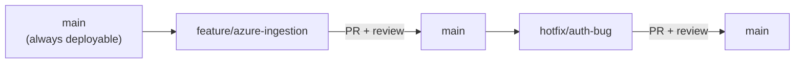
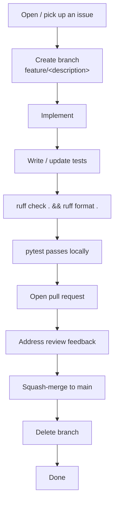
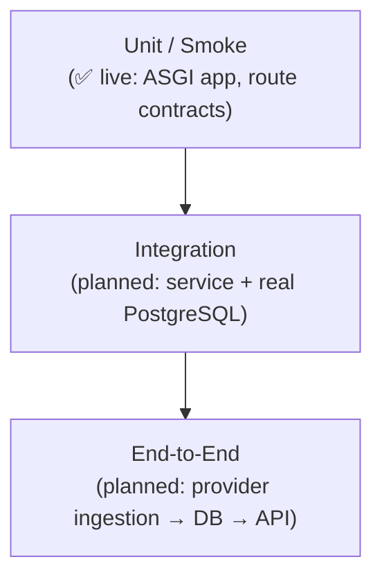
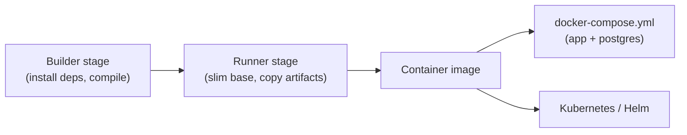
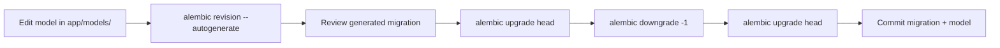
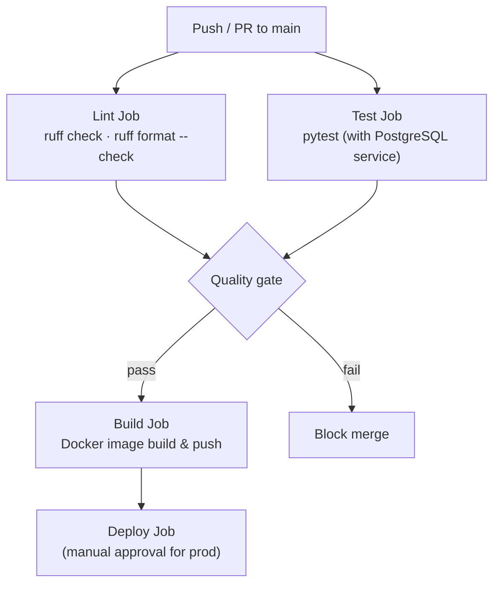

# Development Workflow

> **Purpose**
> This document defines the engineering workflow for the Multi-Cloud AI
> Cost Detective (MCAICD) project — from the first clone of the repository
> to a merged pull request and a shipped release. It is the operational
> companion to [`CONTRIBUTING.md`](../CONTRIBUTING.md), which covers
> contributor onboarding and standards at a higher level.
>
> **Audience**
> All contributors — full-time engineers, open-source contributors, and
> reviewers — who need to know how work flows through the repository.
>
> **Last Updated:** 2026-06-28 (Sprint 0.2)

---

## Table of Contents

- [Repository Structure](#repository-structure)
- [Git Branching Strategy](#git-branching-strategy)
- [Commit Message Convention](#commit-message-convention)
- [Feature Development Flow](#feature-development-flow)
- [Pull Request Checklist](#pull-request-checklist)
- [Code Review Guidelines](#code-review-guidelines)
- [Testing Strategy](#testing-strategy)
- [Linting](#linting)
- [Formatting](#formatting)
- [Environment Setup](#environment-setup)
- [Docker Workflow](#docker-workflow)
- [Database Migration Workflow](#database-migration-workflow)
- [Release Process](#release-process)
- [CI/CD Philosophy](#cicd-philosophy)
- [Future GitHub Actions Pipeline](#future-github-actions-pipeline)
- [Best Practices](#best-practices)
- [Coding Standards](#coding-standards)

---

## Repository Structure

```text
MCAICD/
├── .github/                # Issue templates, PR template, CODEOWNERS
├── alembic/                # Migration config, env, and versioned scripts
│   ├── env.py              # Async migration runner
│   ├── script.py.mako      # Migration file template
│   └── versions/           # One file per revision
├── app/
│   ├── api/                # Transport layer
│   │   ├── deps.py         # Shared FastAPI dependencies
│   │   ├── router.py       # Aggregated /api/v1 router
│   │   └── routes/        # Individual route modules
│   ├── core/               # Cross-cutting concerns
│   │   ├── config.py       # Pydantic Settings
│   │   ├── logging.py      # Structured JSON logging
│   │   └── openapi.py      # OpenAPI / Swagger metadata
│   ├── database/           # Data access infrastructure
│   │   ├── base.py         # Declarative base + naming conventions
│   │   └── session.py      # Async engine + session factory
│   ├── models/             # SQLAlchemy ORM models
│   ├── schemas/            # Pydantic request/response schemas
│   ├── services/           # Business logic (transport-agnostic)
│   └── main.py             # Application factory
├── docs/                   # Engineering documentation
│   ├── adr/                # Architecture Decision Records
│   ├── architecture.md
│   ├── development-workflow.md
│   └── project-roadmap.md
├── scripts/
│   └── check_db.py         # Database connectivity diagnostic
├── tests/                  # Test suite (mirrors app/ structure)
│   ├── conftest.py         # Shared fixtures
│   └── test_api.py         # Smoke tests
├── .env.example            # Documented environment template
├── .gitignore
├── alembic.ini             # Alembic configuration
├── CHANGELOG.md
├── CONTRIBUTING.md
├── docker-compose.yml      # Local PostgreSQL
├── pyproject.toml          # Project metadata, deps, ruff/pytest config
├── README.md
├── requirements.txt        # Frozen/pinned dependencies (if used)
└── SECURITY.md
```

**Layering rule:** dependencies point inward. `routes/` depends on
`services/` and `schemas/`; `services/` depends on `models/` and
`database/`; nothing in `services/` imports from `api/`. This is the
contract that keeps the domain logic reusable outside FastAPI.

---

## Git Branching Strategy

MCAICD uses a trunk-based branching model with short-lived feature branches.



| Branch type | Prefix | Lifespan | Example |
| ----------- | ------ | -------- | ------- |
| Feature | `feature/` | Days, not weeks | `feature/azure-cost-ingestion` |
| Bug fix | `bugfix/` | Short | `bugfix/health-timestamp-tz` |
| Hotfix | `hotfix/` | Urgent, off `main` | `hotfix/auth-token-expiry` |
| Chore | `chore/` | Short | `chore/bump-sqlalchemy` |
| Docs | `docs/` | Short | `docs/update-roadmap` |

**Rules:**

- `main` is always green. Never commit directly to `main`.
- Branches are lowercase, kebab-case, with a type prefix.
- Branches are deleted after their PR is merged.
- Long-lived branches are a smell. If a branch lives longer than a sprint,
  it should be broken into smaller PRs.
- Rebase onto `main` before opening a PR to avoid merge commits in the
  history.

**Merge strategy:** squash-merge. The PR title (a conventional commit)
becomes the single commit message on `main`, keeping the history linear and
readable.

---

## Commit Message Convention

The project follows [Conventional Commits](https://www.conventionalcommits.org/).

```
<type>(<optional scope>): <short imperative description>

<optional body explaining WHY>

<optional footer>
```

| Type | Use when |
| ---- | -------- |
| `feat` | A new feature visible to users or downstream consumers. |
| `fix` | A bug fix. |
| `docs` | Documentation-only changes. |
| `refactor` | A code change that neither fixes a bug nor adds a feature. |
| `test` | Adding or correcting tests. |
| `chore` | Build, tooling, dependencies, or config. |
| `perf` | A change that improves performance. |
| `ci` | CI/CD pipeline changes. |

**Examples:**

```
feat(auth): add JWT bearer token verification
fix(health): catch OSError from asyncpg to return 503
docs: add architecture decision records
chore: bump SQLAlchemy to 2.0.32
```

**Why conventional commits?** They enable automated changelog generation,
semantic versioning decisions, and release notes — all of which matter once
the CI pipeline is in place (Sprint 0.9). They also make the history
scannable: a reviewer can tell from `git log --oneline` whether a PR is a
feature or a fix without reading the diff.

---

## Feature Development Flow



1. **Open or pick up an issue.** Every non-trivial change starts with an
   issue so the intent is recorded before code is written.
2. **Create a branch** from `main` using the naming strategy above.
3. **Implement.** Keep routes thin; put logic in `app/services/`. Add models
   to `app/models/` and schemas to `app/schemas/`.
4. **Write tests.** At minimum: one happy-path test and one error-path test
   per endpoint or service method.
5. **Run the quality gate locally:**
   ```bash
   ruff check .
   ruff format .
   pytest
   ```
6. **Open a pull request** against `main` using the
   [PR template](../.github/PULL_REQUEST_TEMPLATE.md).
7. **Link the issue** (`Closes #123`) so it auto-closes on merge.
8. **Request review.** The `CODEOWNERS` file adds the required reviewer
   automatically.
9. **Address feedback** with additional commits. Avoid force-pushing once
   review has started — it invalidates review context.
10. **Squash-merge.** The PR title (a conventional commit) becomes the
    commit on `main`.
11. **Delete the branch** after merge.

---

## Pull Request Checklist

The PR template captures the full list. The non-negotiable items:

- [ ] Branch follows the naming convention.
- [ ] Commits follow Conventional Commits.
- [ ] `ruff check .` passes with no errors.
- [ ] `ruff format .` produces no diff.
- [ ] `pytest` passes.
- [ ] Tests added or updated for the change.
- [ ] Self-review of the diff completed.
- [ ] PR description explains *why*, not just *what*.
- [ ] Related issue linked (`Closes #123`).
- [ ] Documentation updated where relevant (README, CHANGELOG, docstrings).
- [ ] No secrets committed (`.env` is git-ignored; double-check staged files).

---

## Code Review Guidelines

Reviewers and authors share responsibility for code quality. Review is a
collaboration, not a gatekeeping exercise.

### For authors

- **Self-review first.** Read your own diff before requesting review. Catch
  the obvious issues yourself.
- **Explain the why.** The PR description should make the reviewer
  understand the problem before they read the diff.
- **Keep PRs small.** One logical change per PR. If the diff is over ~400
  lines, consider splitting.
- **Respond to every comment.** Either implement the suggestion, push back
  with reasoning, or explicitly defer to a follow-up.

### For reviewers

- **Review in order:** correctness, security, performance, clarity.
  Correctness trumps style; style trumps preference.
- **Be specific.** "This is wrong" is not useful. "This will N+1 because the
  loop re-enters the session per row; consider a batched query" is useful.
- **Suggest, don't dictate.** Offer alternatives. Let the author own the
  solution.
- **Approve only when the quality gate passes.** `ruff check`, `ruff
  format`, and `pytest` must all be green.
- **Distinguish blockers from nits.** Use "blocking:" / "nit:" prefixes so
  the author knows what must change before merge.

### Review SLA

- First response within **1 business day** for internal contributors.
- Approve-or-request-changes within **2 business days**.
- If a PR is blocked on review for >3 days, ping in the issue or escalate.

---

## Testing Strategy

### Philosophy

Tests prove behaviour, not shape. A passing type check is not a test. A test
that asserts a function was called is a proxy, not a verification.

### Test pyramid



| Level | Status | Scope | Tooling |
| ----- | ------ | ----- | ------- |
| Smoke / unit | ✅ Live | Route contracts, schema validation, app wiring. | `pytest`, `pytest-asyncio`, `httpx` + `ASGITransport`. |
| Integration | ⏳ Planned | Service + real PostgreSQL (via testcontainers or a dedicated DB). | `pytest`, `testcontainers-python` (candidate). |
| End-to-end | ⏳ Planned | Ingestion → normalisation → DB → API response. | `pytest`, real provider stubs. |

### Current test fixtures

- `tests/conftest.py` provides an `AsyncClient` wired directly to the ASGI
  app via `ASGITransport`. Tests exercise the real application without
  binding a network port.
- `asyncio_mode = "auto"` is set in `pyproject.toml` so async tests do not
  need an explicit `@pytest.mark.asyncio` decorator (though they may use
  one).

### Test expectations

- Every new endpoint: at least one happy-path test and one error-path test.
- Every new service method: a unit test with a controlled input.
- Tests mirror the `app/` structure under `tests/`.
- No snapshot files or large fixtures. Keep test data inline and minimal.
- `pytest` must pass locally before a PR is submitted.

### What is not a test

- `ruff check .` passing — that is linting.
- `mypy` / type-check passing — that is type validation.
- A test that mocks the system under test so thoroughly that it only asserts
  the mock was called — that is a proxy.

---

## Linting

The project uses [Ruff](https://docs.astral.sh/ruff/) for linting.

```bash
ruff check .          # Lint
ruff check . --fix    # Lint and auto-fix
```

The rule set is configured in `pyproject.toml`:

```toml
[tool.ruff.lint]
select = ["E", "F", "I", "UP", "B", "ASYNC"]
```

| Code | Rule group | What it catches |
| ---- | ---------- | --------------- |
| `E` | pycodestyle errors | Style violations. |
| `F` | Pyflakes | Unused imports, undefined names. |
| `I` | isort | Import ordering. |
| `UP` | pyupgrade | Modernise syntax to Python 3.12+. |
| `B` | flake8-bugbear | Common pitfalls and likely bugs. |
| `ASYNC` | flake8-async | Async-specific issues. |

**Why Ruff over flake8 + isort + black?** Ruff is a single tool, written in
Rust, that replaces three tools with one config and one invocation. It is
orders of magnitude faster and removes the "which tool lints what"
ambiguity.

---

## Formatting

Ruff also handles formatting.

```bash
ruff format .         # Format all files
ruff format --check . # Check without writing (CI mode)
```

- **Line length:** 100 characters.
- **Target version:** Python 3.12.

Formatting is non-negotiable. A PR that fails `ruff format --check .` does
not get reviewed. The Alembic config wires Ruff as a post-write hook
(`alembic.ini` → `[post_write_hooks]`) so autogenerated migrations are
formatted automatically.

---

## Environment Setup

### Prerequisites

- **Python** 3.12 or newer (the project pins `>=3.12,<3.13`).
- **Docker Desktop** (for the local PostgreSQL instance).
- **Git**.

### One-time setup

```bash
# Clone
git clone git@github.com:manikantadakarapu/multi-cloud-ai-cost-detective.git
cd multi-cloud-ai-cost-detective

# Virtual environment
python -m venv .venv
source .venv/bin/activate        # Linux / macOS / WSL
# .\.venv\Scripts\Activate.ps1   # Windows PowerShell

# Install (editable, with dev extras)
pip install -e ".[dev]"

# Configure environment
cp .env.example .env
# Edit .env — set DATABASE_URL to match your PostgreSQL credentials

# Start PostgreSQL
docker compose up -d

# Run migrations
alembic upgrade head

# Start the dev server
uvicorn app.main:app --reload
```

### Environment variables

See the [Environment Variables](../README.md#environment-variables) table in
the README for the full list. The single most important variable is
`DATABASE_URL`, which must use the `postgresql+asyncpg://` scheme.

> **Common footgun:** if `DATABASE_URL` is exported in your shell, it
> silently overrides `.env`. The `Settings.database_url_source` field
> reports which source is active, and `scripts/check_db.py` prints it. If
> editing `.env` "has no effect", check your shell environment first.

---

## Docker Workflow

### Current state

Docker Compose provisions a local PostgreSQL 16 instance only. The FastAPI
application itself is not yet containerised (planned for Sprint 0.9).

```bash
docker compose up -d           # Start PostgreSQL
docker compose down            # Stop PostgreSQL
docker compose down -v         # Stop and delete the data volume
docker compose ps              # Check container status
docker compose logs postgres   # View PostgreSQL logs
```

The `docker-compose.yml` defines:

- A `postgres:16` service with a healthcheck (`pg_isready`).
- A named volume (`postgres-mcaicd-data`) for data persistence.
- Configurable credentials via `POSTGRES_USER` / `POSTGRES_PASSWORD` /
  `POSTGRES_DB` environment variables.

> **Important:** `POSTGRES_USER` / `POSTGRES_PASSWORD` / `POSTGRES_DB` are
> only honoured the **first** time the data volume is initialised. Changing
> them later does not update the running PostgreSQL user. To change
> credentials after the volume exists, drop the volume and recreate, or run
> `ALTER USER ... WITH PASSWORD '...'` inside `psql`.

### Future Docker workflow (Sprint 0.9)

A multi-stage `Dockerfile` will containerise the application:



- Multi-stage build: a builder stage installs dependencies; a slim runner
  stage copies only the runtime artifacts.
- The image runs as a non-root user.
- `docker-compose.yml` extended to include the application service for
  full-stack local development.

---

## Database Migration Workflow

Migrations are managed by Alembic with an async `env.py` runner.

### Create a migration

```bash
# After changing models in app/models/:
alembic revision --autogenerate -m "add cost_records table"
```

This generates a file under `alembic/versions/` using the configured
`file_template` (`%%(year)d%%(month).2d%%(day).2d_%%(hour).2d%%(minute).2d_%%(rev)s_%%(slug)s`).
Ruff formats the generated file automatically via the `[post_write_hooks]`
config in `alembic.ini`.

### Apply migrations

```bash
alembic upgrade head            # Apply all pending migrations
alembic downgrade -1            # Roll back one revision
alembic current                 # Show the current revision
alembic history                 # Show the migration chain
```

### Migration rules

- **Never edit a migration that has been merged to `main`.** Create a new
  migration to correct it.
- **Review the autogenerate output.** Alembic detects schema changes, but
  it does not understand intent. Verify `upgrade()` and `downgrade()` are
  symmetric.
- **Test the downgrade path.** A migration that cannot be rolled back is a
  production hazard. Run `alembic downgrade -1` then `alembic upgrade head`
  locally before submitting.
- **Data migrations go in the same file, after the schema change.** Keep
  them idempotent.
- **The `env.py` masks the database URL before logging.** The masked URL
  and the `database_url_source` are printed on every Alembic run so you
  always know which database you are migrating.



---

## Release Process

MCAICD follows [Semantic Versioning](https://semver.org/spec/v2.0.0.html):
`MAJOR.MINOR.PATCH`.

| Version bump | When |
| ------------ | ---- |
| `PATCH` | Bug fixes, no new API surface. |
| `MINOR` | New features, backwards-compatible. |
| `MAJOR` | Breaking changes (reserved for 1.0 and beyond). |

### Release steps

1. **Ensure `main` is green.** All tests pass, no pending PRs.
2. **Update `CHANGELOG.md`.** Move `[Unreleased]` entries to a new version
   heading, following [Keep a Changelog](https://keepachangelog.com/).
3. **Bump the version** in `pyproject.toml` and `app/core/config.py`
   (`app_version` default).
4. **Commit** with `chore(release): vX.Y.Z`.
5. **Tag** the commit: `git tag -a vX.Y.Z -m "Release vX.Y.Z"`.
6. **Push the tag:** `git push origin vX.Y.Z`.
7. **Create a GitHub Release** from the tag, pasting the changelog section
   as the release notes.

> The release process is manual today. Once CI is in place (Sprint 0.9),
> tagging will trigger an automated build and publish pipeline.

---

## CI/CD Philosophy

The CI/CD philosophy is: **every push to `main` is a release candidate.**

| Principle | What it means in practice |
| --------- | ------------------------ |
| **Green main** | `main` is always deployable. A broken `main` is a P0. |
| **Local-first quality gate** | The same commands run in CI (`ruff check`, `ruff format --check`, `pytest`) must pass locally first. CI is a verification of local discipline, not a replacement for it. |
| **Fast feedback** | CI should complete in minutes, not tens of minutes. Lint and test stages run in parallel where independent. |
| **Fail loud** | A failing step fails the pipeline. No warnings-as-errors confusion. |
| **No merge without green** | A PR is not mergeable until CI passes on the latest push. |
| **Reproducible builds** | The CI environment matches local Docker Compose. The same image runs in CI, staging, and production. |

---

## Future GitHub Actions Pipeline

> **Status:** Planned for Sprint 0.9. Not yet implemented.



### Planned pipeline stages

| Stage | Job | Trigger | Purpose |
| ----- | --- | ------- | ------- |
| `lint` | `ruff check . && ruff format --check .` | Every PR / push | Fast feedback on style and bugs. |
| `test` | `pytest` against a PostgreSQL service container | Every PR / push | Behavioural verification. |
| `build` | Multi-stage Docker build + push to registry | On merge to `main` or tag | Produce the deployable artifact. |
| `deploy-staging` | Deploy to staging cluster | On merge to `main` | Continuous deployment to staging. |
| `deploy-prod` | Deploy to production | On tag push, manual approval | Gated production release. |

### Planned security stages

| Stage | Job | Purpose |
| ----- | --- | ------- |
| `dependency-scan` | Dependabot / `pip-audit` | Surface known-vulnerable dependencies. |
| `secret-scan` | `gitleaks` | Catch secrets before they reach `main`. |
| `container-scan` | Trivy on the built image | Scan the image for CVEs. |

---

## Best Practices

- **Keep routes thin.** A route handler should parse input, call a service,
  and shape output. No business logic in `app/api/routes/`.
- **Services own their resources.** When a service needs to degrade
  gracefully (like `HealthService`), it owns the session lifecycle rather
  than accepting a request-scoped session.
- **Configuration through `Settings`, always.** Never call `os.getenv()` in
  application code.
- **Async-first.** No synchronous database calls. The engine, sessions, and
  migrations are all async.
- **Fail with context.** Log the exception, not just the message. The
  `JsonFormatter` preserves structured fields and exception tracebacks.
- **Small PRs.** One logical change per PR. Reviewable in one sitting.
- **Document the why.** Code comments explain intent; the diff shows the
  what.
- **Keep the ADR trail current.** Any architectural decision that affects
  more than one file gets an ADR. See [`docs/adr/`](adr/).

---

## Coding Standards

| Concern | Standard |
| ------- | -------- |
| Language | Python 3.12+. Use modern type hints (`list[str]`, not `List[str]`). |
| Type hints | Required on all function signatures. |
| Docstrings | Required on public classes and functions. Explain the contract, not the implementation. |
| Imports | Sorted by Ruff (`isort` rules). No unused imports. |
| Line length | 100 characters. |
| Naming | `snake_case` for functions and variables; `PascalCase` for classes; `UPPER_SNAKE` for constants. |
| Async | All I/O is async. `async def` for handlers and services that touch the DB or external APIs. |
| Error handling | Catch specific exceptions, not bare `except`. Log with context. |
| Secrets | Never in code. Never in `.env` committed to the repo. Flow through `Settings`. |
| Dependencies | No new dependency without maintainer review. Prefer the standard library. |

The full contributor guide, including local setup and the branch naming
table, lives in [`CONTRIBUTING.md`](../CONTRIBUTING.md).
