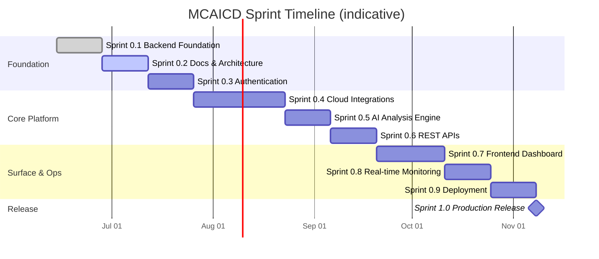
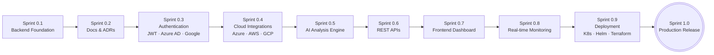

# Project Roadmap

> **Purpose**
> This document is the canonical product and engineering roadmap for the
> Multi-Cloud AI Cost Detective (MCAICD) platform. It communicates the vision,
> the sprint cadence, the milestone plan, and the decision boundaries that
> govern what is built and when.
>
> **Audience**
> Engineering managers, staff engineers, contributors, recruiters, and
> hiring managers who need to understand where the project is headed and how
> the near-term work ladders up to the long-term vision.
>
> **Last Updated:** 2026-06-28 (Sprint 0.2)
>
> **Status legend:** ✅ Complete · 🚧 In Progress · ⏳ Planned · 🔭 Future

---

## Table of Contents

- [Vision](#vision)
- [Project Goals](#project-goals)
- [Sprint Cadence](#sprint-cadence)
- [Current Sprint Status](#current-sprint-status)
- [Roadmap Overview](#roadmap-overview)
- [Planned Milestones](#planned-milestones)
- [Feature Timeline](#feature-timeline)
- [Future Enhancements](#future-enhancements)
- [Long-term Vision](#long-term-vision)
- [Non-Goals](#non-goals)
- [Change Log](#change-log)

---

## Vision

> **Become the de-facto open platform that gives every cloud engineering team
> a single, honest view of where their AI spend is going — across AWS, Azure,
> and GCP — and the AI-driven recommendations to bring it back under control.**

Cloud cost tooling today is fragmented along provider boundaries. Each cloud
ships its own billing console, its own tagging model, and its own anomaly
alerts. Teams that run workloads on more than one provider end up
reconciling spreadsheets, missing cross-cloud cost drift, and reacting to
surprise bills weeks after the damage is done.

MCAICD closes that gap. It ingests billing and usage data from every major
cloud, normalises it into a single schema, applies anomaly detection to
surface unexpected spend in near real time, and layers an AI recommendation
engine on top to suggest concrete, actionable optimisations — not dashboards
that require a human analyst to interpret.

---

## Project Goals

| # | Goal | Why it matters |
| - | ---- | -------------- |
| 1 | **Provider-agnostic ingestion** | One pipeline, three clouds. Cost data normalised into a unified schema so cross-cloud analysis is a first-class operation, not an export-and-reconcile afterthought. |
| 2 | **AI-driven recommendations** | Move from "you spent more" to "here is exactly what to turn off, resize, or commit to, and how much you will save." |
| 3 | **Production-grade engineering** | Clean architecture, typed contracts, migration-managed schema, Docker-first development, structured observability. The platform must be operable, not just demonstrable. |
| 4 | **Open and extensible** | A clean provider abstraction and a documented ADR trail so contributors can add a cloud or an AI provider without touching core logic. |
| 5 | **Self-hostable** | No vendor lock-in on the platform itself. Teams own their data, their keys, and their deployment topology. |

---

## Sprint Cadence

MCAICD follows a two-week sprint cadence with numbered sprints. Sprint `0.x`
sprints build the foundation; sprint `1.0` marks the first production-ready
release.

> Dates are indicative and adjusted at sprint planning. The graph reflects
> sequencing dependencies, not hard calendar commitments.

---

## Current Sprint Status

### Sprint 0.2 — Engineering Documentation & Architecture 🚧

**Focus:** Production-quality documentation, architecture record trail, and
engineering workflow definition. No new application code is introduced; the
sprint hardens the foundation laid in 0.1 so the project is reviewable and
contributor-ready before authentication work begins.

| Deliverable | Status |
| ----------- | ------ |
| `docs/architecture.md` | ✅ Delivered |
| `docs/project-roadmap.md` | ✅ Delivered |
| `docs/development-workflow.md` | ✅ Delivered |
| ADR-0001 through ADR-0005 | ✅ Delivered |
| README "Project Documentation" section | ✅ Delivered |

**Exit criteria:** the repository reads as a professionally engineered
project — a new contributor can orient themselves, understand every
architectural choice, and start contributing within one session.

---

### Sprint 0.1 — Backend Foundation ✅ Complete

Shipped the production backend foundation. The full changelog entry is in
[`CHANGELOG.md`](../CHANGELOG.md) under `[0.1.0]`.

Highlights:

- FastAPI application factory with lifespan management.
- Async SQLAlchemy 2.x engine, session factory, and declarative base with
  naming conventions.
- Alembic migration setup with autogenerate and an async `env.py`.
- Pydantic v2 Settings configuration with `.env` loading and a
  `database_url_source` diagnostic field.
- Structured JSON logging with a custom `JsonFormatter`.
- Production health endpoint (`GET /api/v1/health`) with a live `SELECT 1`
  probe and HTTP 503 degradation.
- Service root endpoint (`GET /`) for discovery.
- Rich OpenAPI / Swagger metadata.
- Docker Compose for local PostgreSQL 16.
- Test scaffold with `pytest`, `pytest-asyncio`, and an httpx ASGI client.

---

## Roadmap Overview

| Sprint | Status | Description |
| ------ | ------ | ----------- |
| 0.1 | ✅ Complete | Backend foundation — FastAPI app factory, async SQLAlchemy 2.x, PostgreSQL, Alembic, structured logging, health endpoint. |
| 0.2 | 🚧 In Progress | Engineering documentation & architecture — ADRs, architecture doc, development workflow, roadmap. |
| 0.3 | ⏳ Planned | Authentication — JWT bearer auth, Azure AD (OIDC), Google Login (OAuth 2.0), role-based access control. |
| 0.4 | ⏳ Planned | Cloud integrations — Azure Cost Management, AWS Cost Explorer, GCP Billing export, unified normalised schema. |
| 0.5 | ⏳ Planned | AI analysis engine — anomaly detection, idle resource detection, recommendation generation. |
| 0.6 | ⏳ Planned | REST APIs — cost query, anomaly, recommendation, and reporting endpoints with pagination and filtering. |
| 0.7 | ⏳ Planned | Frontend dashboard — React/Next.js, cost breakdowns, anomaly feed, recommendation inbox. |
| 0.8 | ⏳ Planned | Real-time monitoring — WebSocket anomaly push, alerting rules, notification channels. |
| 0.9 | ⏳ Planned | Deployment — Dockerfile for the app, Kubernetes manifests, Helm chart, Terraform IaC. |
| 1.0 | 🔭 Future | Production release — hardening, load testing, security audit, GA. |

---

## Planned Milestones

### Milestone M1 — Foundation Locked (Sprint 0.1) ✅

The backend is runnable, the database is wired, migrations are in place, and
a health probe proves the stack end-to-end. This milestone exists so that
every subsequent sprint starts from a green build, not a whiteboard.

**Evidence:** `pytest` passes; `GET /api/v1/health` returns `healthy` against
a live PostgreSQL; `alembic upgrade head` runs cleanly.

### Milestone M2 — Engineering Readiness (Sprint 0.2) 🚧

The repository is contributor-ready: a new engineer can clone, read the ADRs,
understand the architecture, and start a focused task within a single
session. This is the gate that must clear before authentication work begins,
because authentication will touch every layer and the decisions need to be
recorded first.

**Evidence:** `docs/` populated; five ADRs accepted; README links to all
documentation.

### Milestone M3 — Authenticated API Surface (Sprint 0.3)

The platform has a real identity boundary. JWT bearer tokens gate every
non-health endpoint, Azure AD and Google Login are supported as enterprise
identity providers, and a role model distinguishes read-only analysts from
administrators.

**Evidence:** protected endpoints return 401 without a token; role-based
tests pass; Azure AD and Google OIDC flows complete end-to-end.

### Milestone M4 — Unified Cost Corpus (Sprint 0.4)

For the first time the platform holds real cost data from all three clouds
in a single normalised schema. This is the milestone that makes everything
downstream (anomaly detection, recommendations, dashboards) possible.

**Evidence:** Azure, AWS, and GCP ingestion jobs run to completion; the
normalised tables contain cross-provider rows; a sample query returns a
unified cost breakdown.

### Milestone M5 — AI Recommendations (Sprint 0.5)

The platform stops being a cost mirror and starts being a cost advisor. The
anomaly engine flags unexpected spend; the recommendation engine produces
ranked, actionable suggestions backed by the AI provider abstraction.

**Evidence:** anomaly detection surfaces a seeded spike; the recommendation
endpoint returns ordered suggestions with estimated savings.

### Milestone M6 — Public API (Sprint 0.6)

The platform exposes a versioned, documented, paginated REST surface that
external integrations and the future dashboard can consume.

**Evidence:** `/api/v1` cost, anomaly, and recommendation endpoints are live;
OpenAPI spec is complete; integration tests cover happy and error paths.

### Milestone M7 — Operator Surface (Sprint 0.7 + 0.8)

Engineering and finance teams can use a real UI: dashboards for cost
breakdowns, an anomaly feed, and a recommendation inbox, with real-time
WebSocket push for live anomalies.

**Evidence:** dashboard renders real cost data; WebSocket channel delivers a
seeded anomaly event; alerting rules fire to configured channels.

### Milestone M8 — Production Deployment (Sprint 0.9 → 1.0)

The platform runs in Kubernetes with IaC-provisioned infrastructure, a CI/CD
pipeline, and a security audit complete. Sprint 1.0 marks general
availability.

**Evidence:** Helm chart deploys to a staging cluster; Terraform provisions
the cloud backing; load tests meet the SLO; security review passes.

---

## Feature Timeline

The timeline is strictly sequential up to Sprint 0.6 because each layer is
the input to the next: you cannot detect anomalies without ingested cost
data, and you cannot expose recommendations without a detection engine.
From Sprint 0.7 onward some parallelisation is possible (dashboard and
real-time monitoring share a frontend) but the roadmap keeps them ordered
to preserve review focus.

---

## Future Enhancements

Beyond Sprint 1.0, the platform is expected to grow along these axes. None
of these are committed sprints — they are the candidate backlog.

- **Multi-tenant isolation** — per-organisation data partitions so the
  platform can be offered as a hosted service, not just self-hosted.
- **FinOps collaboration** — approval workflows for recommendations so a
  platform engineer can accept, defer, or reject a suggestion and the
  outcome feeds back into the model.
- **Predictive budgeting** — forward-looking budget forecasts derived from
  historical spend trajectories, not just rear-looking anomaly detection.
- **Reserved-instance / commitment optimiser** — a dedicated analyser that
  recommends committed-use purchases across providers.
- **Carbon cost attribution** — surface the carbon footprint of cloud spend
  alongside the dollar cost, using provider sustainability APIs.
- **Terraform / IaC drift integration** — correlate cost anomalies with
  infrastructure changes so a spike is traceable to a merged PR.
- **Plugin marketplace** — a stable extension contract so third parties can
  ship custom cost analysers without forking the core.

---

## Long-term Vision

The north star is a platform that a platform engineering team can drop in
next to their existing observability stack and get, within a day, a single
view of cloud spend across every provider they run — with AI doing the
first pass of triage so the team spends its time acting on recommendations,
not building spreadsheets.

Three properties define that future state:

1. **Provider-agnostic by default.** Adding a fourth cloud is a
   provider-adapter contribution, not a platform re-architecture. The ADR
   trail (see [ADR-0005](adr/ADR-0005-ai-provider-abstraction.md)) is the
   contract that protects this.
2. **AI as a colleague, not a dashboard.** The platform's output is a ranked
   list of actions with estimated savings and rollback notes — not a chart
   that requires a human to decide what it means.
3. **Ownable.** No SaaS dependency on the platform itself. Teams self-host,
   own their keys, and keep their billing data inside their own boundary.

---

## Non-Goals

Being explicit about what MCAICD is **not** trying to be keeps scope honest:

- **Not a general-purpose FinOps suite.** The focus is AI cost detection and
  recommendation, not procurement, invoicing, or chargeback workflows.
- **Not a cloud management platform.** MCAICD does not provision, scale, or
  terminate resources. It recommends; the operator acts.
- **Not a replacement for provider billing consoles.** The platform
  ingests and normalises billing data; the provider console remains the
  source of truth for invoice-level detail.
- **Not a real-time streaming cost pipeline.** Sprint 0.8 adds real-time
  *anomaly* monitoring, not real-time *cost* ingestion. Billing data is
  inherently lagged by the provider's own refresh cadence.

---

## Change Log

| Date | Sprint | Change |
| ---- | ------ | ------ |
| 2026-06-27 | 0.1 | Initial roadmap published with backend foundation complete. |
| 2026-06-28 | 0.2 | Roadmap restructured into sprint-based plan; added milestones, timeline, non-goals, and long-term vision. |
